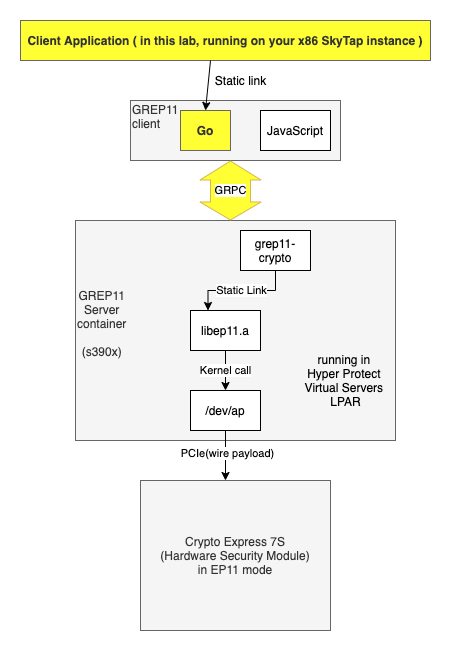

# GREP11 Lab Overview

## GREP11 Overview

In this lab you will be working with the GREP11 feature of the [Hyper Protect Virtual Servers on-premises](https://www.ibm.com/support/knowledgecenter/SSHPMH_1.2.x/kc_welcome_page.html){target=_blank} offering.

GREP11 is a shorthand term for *gRPC protocol-based Enterprise PKCS#11*.

PKCS #11 refers to the [Public Key Cryptography Standard #11 Cryptographic Token Interface](http://docs.oasis-open.org/pkcs11/pkcs11-base/v2.40/pkcs11-base-v2.40.html){target=_blank}, which is a standard for devices that hold cryptographic information and perform cryptographic functions.

[gRPC](https://grpc.io/){target=_blank} stands for Google Remote Procedure Call, which is a protocol developed by Google, and contributed to open source. gRPC uses HTTP/2 for its transport protocol.

*Enterprise PKCS#11*, often referred to as *EP11*, refers to [IBM's library](http://public.dhe.ibm.com/security/cryptocards/pciecc4/EP11/docs/ep11-structure.pdf){target=_blank}, designed for enterprise usage, that is very similar to the PKCS #11 standard. 

The PKCS #11 standard covers the following cryptographic categories, and the GREP11 library provides functions in each of these categories:

1. Encryption
2. Decryption
3. Message digests (also known as hashes)
4. Signing and MACing (Message Authentication Codes)
5. Verifying signatures and MACs
6. Key Management- creating symmetric keys, creating asymmetric keys, wrapping and unwrapping keys, and deriving keys from other keys
7. Random number generation - strictly speaking not a cryptographic operation unto itself, but random numbers are often used in cryptographic operations

## Lab Environment

You will be working with the Hyper Protect Virtual Servers command line interface (CLI) running on an x86_64 virtual machine running the Ubuntu 18.04.5 Linux distribution. You will also be using this virtual machine to run programs, written in the Go programming language, that will communicate with the GREP11 server. This virtual machine is provisioned on SkyTap in the IBM Cloud, and you will access it through your web browser. **Your instructor will provide you the information needed to access your virtual machine under separate cover.**

The GREP11 server runs as a Docker container running in Hyper Protect Virtual Servers.  Hyper Protect Virtual Servers runs in a Secure Service Container (SSC) LPAR on an IBM z15 server located in Herndon, Virginia, USA, and managed by the *Advanced Technology Group - IBM Z* team.

The Hyper Protect Virtual Servers LPAR is in an Advanced Technology Group private network and your Ubuntu virtual machine communicates with it through a VPN connection. **Your instructor will provide you the information needed to establish a VPN connection under separate cover.**

!!! note

    The client program code used in this lab could also be run on the s390x architecture.  IBM provides sample client code, which connects to a GREP11 Server, in two programming lanugages - [Go](https://golang.org){target=_blank} and [JavaScript](https://developer.mozilla.org/en-US/docs/Web/JavaScript){target=_blank}, both of which are supported on s390x.
    This lab will utilize client code written in Go.
    
The following diagram summarizes the data flow from the client application you will be running in this lab, to the GREP11 server which runs in the Hyper Protect Virtual Servers LPAR on an IBM Z or LinuxONE server, through kernel calls that call the cryptographic device driver (represented by */dev/ap* in the drawing) which then accesses the Crypto Express 7S card through the PCIe bus.

There is no inherent significance to the highlighted boxes in the drawing.  We highlighted the client application box to point out that the client application does not have to reside on the same host as the GREP11 server.  We highlighted the Go box since we will be working with the Go language GREP11 client in this lab and not the JavaScript GREP11 client. We highlighted GRPC just because, well, the *G* in GREP11 stands for gRPC.  :smile:

## What has been done for you already

Our starting point for the lab is having the GREP11 servers running on our Hyper Protect Virtual Servers LPAR. Each GREP11 server is connected to a single domain on an [IBM Crypto Express 7S](https://www.ibm.com/security/cryptocards/pciecc4/overview){target=_blank} card that is configured to our LPAR. Our Hyper Protect Virtual Servers LPAR has two Crypto Expess 7S cards configured to it, with one domain on each card dedicated to our LPAR.  So, with only two domains and many students, we had to provision the GREP11 servers ahead of time.  

We will describe the process of setting this up so that you will have a reference.

## Detailed Lab Process

1. Read about how we configured the GREP11 servers

2. Issue relevant Hyper Protect Virtual Servers CLI commands

3. Clone the GitHub repository which the lab uses

4. Run Hyper Protect Virtual Servers commands to inspect the GREP11 setup

5. Run the GREP11 samples that IBM documentation points to

6. Run custom lab exercises that go into greater depth

