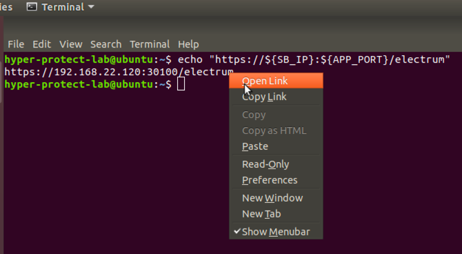
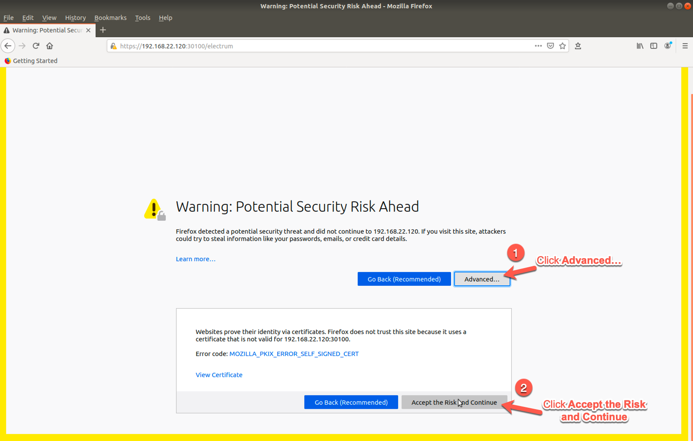

# Deploy your Securely built application into a Hyper Protect Virtual Server

## Export Variables set in previous sections to current terminal session

Source `bashrc` to set necessary variables if unset

``` bash
source "${HOME}/.bashrc"
```

## Set up you Docker Image Repository

1. Register your repository

    ``` bash
    hpvs repository register \
    --pgp="${SB_DIR}/yaml.${REPO_ID}.enc" \
    --id="${REPO_ID}"
    ```

    ???+ example "Example Output"

        ``` bash
        +-----------------+------------------------------+
        | repository name | docker.io/gmoney23/hpvs_bc_a |
        | runtime         | runq                         |
        +-----------------+------------------------------+
        ```

2. View your newly registered repository

    ``` bash
    hpvs repository show --id "${REPO_ID}"
    ```

    ???+ example "Example Output"

        ``` bash
        +-----------------+------------------------------+
        | repository name | docker.io/gmoney23/hpvs_bc_a |
        | runtime         | runq                         |
        +-----------------+------------------------------+
        ```

##  Set up your Quotagroup for storage

1. Create Quotagroup

    ``` bash
    hpvs quotagroup create --name="${REPO_ID}" --size=5GB
    ```

    ???+ example "Example Output"

        ``` bash
        +-------------+--------------+
        | name        | hpvs_bc_a_00 |
        | filesystem  | btrfs        |
        | passthrough | false        |
        | pool_id     | lv_data_pool |
        | size        | 5GB          |
        | available   | 5GB          |
        | containers  | []           |
        +-------------+--------------+
        ```

2. View your newly created quotagroup

    ``` bash
    hpvs quotagroup show --name "${REPO_ID}"
    ```

    ???+ example "Example Output"

        ``` bash
        +-------------+--------------+
        | name        | hpvs_bc_a_00 |
        | filesystem  | btrfs        |
        | passthrough | false        |
        | pool_id     | lv_data_pool |
        | size        | 5GB          |
        | available   | 5GB          |
        | containers  | []           |
        +-------------+--------------+
        ```

## Deploy your Application

1. Set App port

    ``` bash
    export APP_PORT=301${HPVS_NUMBER}
    ```

2. Create your Hyper Protect Virtual Server

    ``` bash
    hpvs vs create --name=${REPO_ID} --repo ${REPO_ID} \
    --tag latest --cpu 2 --ram 2048 \
    --quotagroup "{quotagroup = ${REPO_ID}, mountid = new, mount = /newroot, filesystem = btrfs, size = 4GB}" \
    --ports "{containerport = 443, protocol = tcp, hostport = ${APP_PORT}}"
    ```

    ???+ example "Example Output"

        ``` bash
        ╭─────────────┬──────────────────────────────╮
        │ PROPERTIES  │ VALUES                       │
        ├─────────────┼──────────────────────────────┤
        │ Name        │ hpvs_bc_a_00                 │
        │ Status      │ Up Less than a second        │
        │ CPU         │ 2                            │
        │ Memory      │ 2048                         │
        │ Networks    │ Network:bridge               │
        │             │ IPAddress:172.31.0.8         │
        │             │ Gateway:172.31.0.1           │
        │             │ Subnet:16                    │
        │             │ MacAddress:02:42:ac:1f:00:08 │
        │             │                              │
        │             │                              │
        │ Ports       │ LocalPort:443/tcp            │
        │             │ GuestPort:30100              │
        │             │                              │
        │ Quotagroups │ appliance_data               │
        │             │ hpvs_bc_a_00                 │
        │             │                              │
        │ State       │ running                      │
        ╰─────────────┴──────────────────────────────╯
        ```

3. Check on the Quotagroup (and see the application is indeed using it)

    ``` bash
    hpvs quotagroup show --name "${REPO_ID}"
    ```

    ???+ example "Example Output"

        ```
        +-------------+------------------------+
        | PROPERTIES  | VALUES                 |
        +-------------+------------------------+
        | name        | hpvs_bc_a_00           |
        | filesystem  | btrfs                  |
        | passthrough | false                  |
        | pool_id     | lv_data_pool           |
        | size        | 5GB                    |
        | available   | 751MB                  |
        | containers  | Container:hpvs_bc_a_00 |
        |             | Mountids:"new"         |
        |             |                        |
        |             |                        |
        +-------------+------------------------+
        ```
    
    We can see the Hyper Protect Virtual Server for our application is now taking up the majority of our Quotagroup.

4. If you ever need to check the Hyper Protect Virtual Server you can use the show command

    ``` bash
    hpvs vs show --name=${REPO_ID}
    ```

    ???+ example "Example Output"

        ```
        ╭─────────────┬──────────────────────────────╮
        │ PROPERTIES  │ VALUES                       │
        ├─────────────┼──────────────────────────────┤
        │ Name        │ hpvs_bc_a_00                 │
        │ Status      │ Up 6 minutes                 │
        │ CPU         │ 2                            │
        │ Memory      │ 2048                         │
        │ Networks    │ Network:bridge               │
        │             │ IPAddress:172.31.0.8         │
        │             │ Gateway:172.31.0.1           │
        │             │ Subnet:16                    │
        │             │ MacAddress:02:42:ac:1f:00:08 │
        │             │                              │
        │             │                              │
        │ Ports       │ LocalPort:443/tcp            │
        │             │ GuestPort:30100              │
        │             │                              │
        │ Quotagroups │ appliance_data               │
        │             │ hpvs_bc_a_00                 │
        │             │                              │
        │ State       │ running                      │
        ╰─────────────┴──────────────────────────────╯
        ```

## Access your application

Run the following command to print the address for your electrum wallet application:

``` bash
echo "https://${SB_IP}:${APP_PORT}/electrum"
```

???+ example "Example Output"

    ```
    https://192.168.22.120:30100/electrum
    ```

Your app is now up and running at the address printed in your terminal! 

!!! tip
    You can visit the IP address easily by right-clicking on the link (wih the line under it) in your terminal and selecting `Open Link`
    

!!! info
    This application uses self-signed certificates so don't worry about the certificate warning you'll need to accept in your browser. Just click `Advanced` and then `Accept the Risk and Continue` :smile:
    

In the final part of this lab you will use your newly built application...
