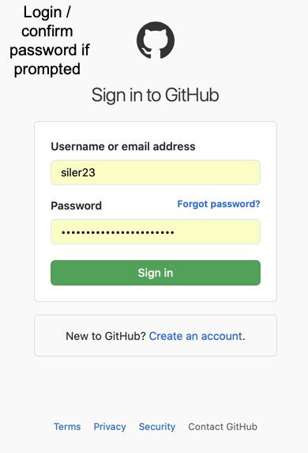
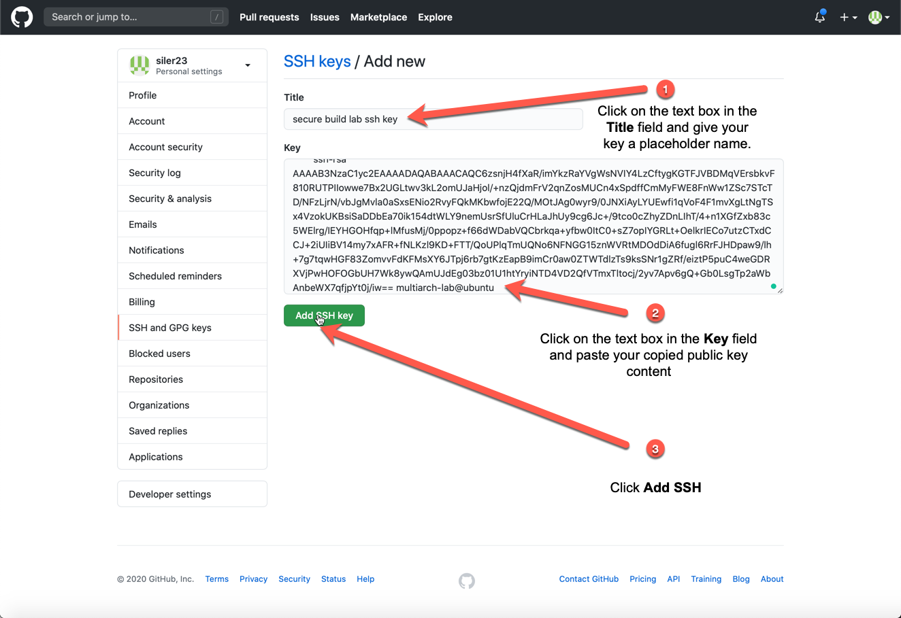

# Configuring your Environment

## Add Docker registry to use for secure build

!!! info
    In this section you will add the details to connect to your Docker Hub Registry so your secure build container can push your securely built images there. Don't worry, your Docker token is safely encrypted on your Skytap Linux VM using the `HPVS Registry CLI Encryption Key` referenced in the [key table](overview.md#fnref:2).

1. See your current Docker registries with:

    ``` bash
    hpvs registry list
    ```

    ???+ example "Example Output"

        ```
        +---------------+
        | REGISTRY NAME |
        +---------------+
        +---------------+
        ```

2. Set your `DOCKER_USERNAME` to the username for your account on [Docker Hub](https://hub.docker.com/){target=_blank}

    === "Command Syntax"

        ``` bash
        export DOCKER_USERNAME="my_username"
        ```

    === "Example Command"

        ``` bash
        export DOCKER_USERNAME="gmoney23"
        ```

    !!! note
        This will be the username you used when you created your [Docker Hub](https://hub.docker.com/){target=_blank} account in the [Prerequisites](../prerequisites.md#Create-a-Docker-Hub){target=_blank}

3. Save your `DOCKER_USERNAME` to `bashrc` for later use.

    ``` bash
    echo "export DOCKER_USERNAME='${DOCKER_USERNAME}'" >> "${HOME}/.bashrc"
    ```

4. Set your `DOCKER_PASSWORD` the token you created for this lab on [Docker Hub](https://hub.docker.com/){target=_blank}.

    === "Command Syntax"

        ``` bash
        export DOCKER_PASSWORD="my_docker_token"
        ```

    === "Example Command"

        ``` bash
        export DOCKER_PASSWORD="123456789"
        ```

    !!! note
        This will be the Docker Hub token you created for the lab in the [Prerequisites](../prerequisites.md#create-a-docker-access-token){target=_blank}

5. Check your [Docker Hub](https://hub.docker.com/){target=_blank} login credentials with a `docker login` and do a `docker logout` to remove unencrypted Docker credentials locally.

    ``` bash
    echo "${DOCKER_PASSWORD}" | docker login -u ${DOCKER_USERNAME} --password-stdin && docker logout
    ```

    ???+ success "Successful login"

        ``` bash
        WARNING! Your password will be stored unencrypted in /home/hyper-protect-lab/.docker/config.json.
        Configure a credential helper to remove this warning. See
        https://docs.docker.com/engine/reference/commandline/login/#credentials-store

        Login Succeeded
        Removing login credentials for https://index.docker.io/v1/
        ```

    ???+ failure "Failed Login :disappointed: Please redo [this section](#add-docker-registry-to-use-for-secure-build)"

        ``` bash
        Error response from daemon: Get https://registry-1.docker.io/v2/: unauthorized: incorrect username or password
        ```

6. Set your `REGISTRY_NAME` to a Docker registry placeholder name of your choosing.

    === "Command Syntax"

        ``` bash
        export REGISTRY_NAME="my_registry"
        ```

    === "Example Command"

        ``` bash
        export REGISTRY_NAME="g_docker_hub"
        ```

7. Save your `REGISTRY_NAME` to `bashrc` for future shells (in case you open new terminals)

    ``` bash
    echo "export REGISTRY_NAME='${REGISTRY_NAME}'" >> "${HOME}/.bashrc"
    ```

8. Add your Docker registry with:

    ``` bash
    echo "${DOCKER_PASSWORD}" | hpvs registry add \
    --name "${REGISTRY_NAME}" --dct https://notary.docker.io \
    --url docker.io --user "${DOCKER_USERNAME}"
    ```

    ???+ example "Example Output"

        ``` bash
        Enter Password:
        ```

    !!! note
        You can ignore the `Enter Password:` prompt because the command does that for you with the `echo "${DOCKER_PASSWORD}" |` before the `hpvs registry add` command.

9. List your registered Docker registries again to confirm your registry has been added.

    ``` bash
    hpvs registry list
    ```

    ???+ example "Example Output"

        ``` bash
        +---------------+
        | REGISTRY NAME |
        +---------------+
        | g_docker_hub  |
        +---------------+
        ```

10. Check the details of your added registry with

    ``` bash
    hpvs registry show --name "${REGISTRY_NAME}"
    ```

    ???+ example "Example Output"

        ``` bash
        +------+--------------------------+
        | name | g_docker_hub             |
        | user | gmoney23                 |
        | dct  | https://notary.docker.io |
        | url  | docker.io                |
        +------+--------------------------+
        ```

## Create directory for secure build lab and change directory

1. Set your secure build directory

    ``` bash
    export SB_DIR="$HOME/securebuild-lab"
    ```

2. Save `SB_DIR` to `$HOME/.bashrc` for future shells (in case you open new terminals)

    ``` bash
    echo "export SB_DIR='${SB_DIR}'" >> "${HOME}/.bashrc"
    ```

3. Create `SB_DIR` and change into it

    ``` bash
    mkdir -p "${SB_DIR}" && cd "${SB_DIR}"
    ```

## Create SSH Key and Grant GitHub access

!!! info
    This section goes through adding the `GitHub SSH Key` referenced in the [key table](overview.md#fnref:2) to your GitHub account to enable cloning GitHub repositories via SSH for secure builds.

1. Create GitHub keys directory

    ``` bash
    mkdir -p "${SB_DIR}/github_keys"
    ```

2. Set `GITHUB_SSH_KEY` variable

    ``` bash
    export GITHUB_SSH_KEY="${SB_DIR}/github_keys/github_rsa"
    ```

3. Save `GITHUB_SSH_KEY` variable in `bashrc` for later use

    ``` bash
    echo "export GITHUB_SSH_KEY='${GITHUB_SSH_KEY}'" >> "${HOME}/.bashrc"
    ```

4. Create Public and private key for GitHub access

    ``` bash
    ssh-keygen -t rsa -b 4096 -f "${GITHUB_SSH_KEY}" -N ''
    ```

    ???+ example "Example Output"

        ``` bash
        Generating public/private rsa key pair.
        Your identification has been saved in /home/multiarch-lab/securebuild-lab/github_keys/github_rsa.
        Your public key has been saved in /home/multiarch-lab/securebuild-lab/github_keys/github_rsa.pub.
        The key fingerprint is:
        SHA256:sbEfCzwyOz/LaZ4jSeKT+Aw7IWUr7YT6m8Hxv9Dq90k multiarch-lab@ubuntu
        The key's randomart image is:
        +---[RSA 4096]----+
        |                 |
        |                 |
        |        o        |
        |  o    . =       |
        | =..  o S .      |
        |+.=o...+ + o     |
        |.=++o++.E o      |
        |. +*+++=++       |
        | .===oo*X+       |
        +----[SHA256]-----+
        ```

5. Cat GitHub public key to terminal

    ``` bash
    cat "${GITHUB_SSH_KEY}.pub"
    ```

    ???+ example "Example Output"

        ``` bash
        ssh-rsa AAAAB3NzaC1yc2EAAAADAQABAAACAQC6zsnjH4fXaR/imYkzRaYVgWsNVIY4LzCftygKGTFJVBDMqVErsbkvF810RUTPIIowwe7Bx2UGLtwv3kL2omUJaHjol/+nzQjdmFrV2qnZosMUCn4xSpdffCmMyFWE8FnWw1ZSc7STcTD/NFzLjrN/vbJgMvla0aSxsENio2RvyFQkMKbwfojE22Q/MOtJAg0wyr9/0JNXiAyLYUEwfi1qVoF4F1mvXgLtNgTSx4VzokUKBsiSaDDbEa70ik154dtWLY9nemUsrSfUluCrHLaJhUy9cg6Jc+/9tco0cZhyZDnLIhT/4+n1XGfZxb83c5WElrg/IEYHGOHfqp+lMfusMj/0ppopz+f66dWDabVQCbrkqa+yfbw0ItC0+sZ7opIYGRLt+OelkrIECo7utzCTxdCCJ+2iUIiBV14my7xAFR+fNLKzl9KD+FTT/QoUPlqTmUQNo6NFNGG15znWVRtMDOdDiA6fugl6RrFJHDpaw9/lh+7g7tqwHGF83ZomvvFdKFMsXY6JTpj6rb7gtKzEapB9imCr0aw0ZTWTdlzTs9ksSNr1gZRf/eiztP5puC4weGDRXVjPwHOFOGbUH7Wk8ywQAmUJdEg03bz01U1htYryiNTD4VD2QfVTmxTltocj/2yv7Apv6gQ+Gb0LsgTp2aWbAnbeWX7qfjpYt0j/iw== multiarch-lab@ubuntu
        ```

6. Copy **your** output (**not** the `Example Output` above) to the clipboard with `ctrl+shift+c`.

    !!! warning
        The above copy command (`ctrl+shift+c`) is saving the `.pub` public key **NOT** the `private` key. You keep the private key and GitHub uses the public key to verify that it is communicating with the owner of the private key (i.e. you).

7. Add this key to your public GitHub at [https://github.com/settings/ssh/new](https://github.com/settings/ssh/new){target=_blank}

    1. Login or confirm your password if prompted

        

    2. Add SSH Key

        

    3. See your new SSH key has been added with your chosen title.

        

    !!! note
        You created this *public* `github.com` GitHub in the [Prerequisites](../prerequisites.md#Create-a-GitHub){target=_blank} (or already had one).

8. Scan for GitHub's public key (Done to trust GitHub connection the first time)

    ``` bash
    ssh-keyscan -H github.com >> "${HOME}/.ssh/known_hosts"
    ```

    !!! example "Example Output"

        ``` bash
        # github.com:22 SSH-2.0-babeld-ffbef2ae
        # github.com:22 SSH-2.0-babeld-ffbef2ae
        # github.com:22 SSH-2.0-babeld-ffbef2ae
        ```

9. Check your GitHub key now has access to your account with:

    ``` bash
    ssh -T git@github.com -i "${GITHUB_SSH_KEY}"
    ```

    !!! success "Your key was added successfully"

        ``` bash
        Warning: Permanently added the RSA host key for IP address '140.82.114.3' to the list of known hosts.
        Hi siler23! You've successfully authenticated, but GitHub does not provide shell access.
        ```

    !!! failure "Your key was **NOT** added :disappointed: Please redo [this section](#create-ssh-key-and-grant-github-access)"

        ``` bash
        Warning: Permanently added the RSA host key for IP address '140.82.113.3' to the list of known hosts.
        git@github.com: Permission denied (publickey).
        ```

10. Feel at ease knowing you will delete this key from your Github account in the cleanup phase of this lab so access will be revoked soon enough :relaxed:
